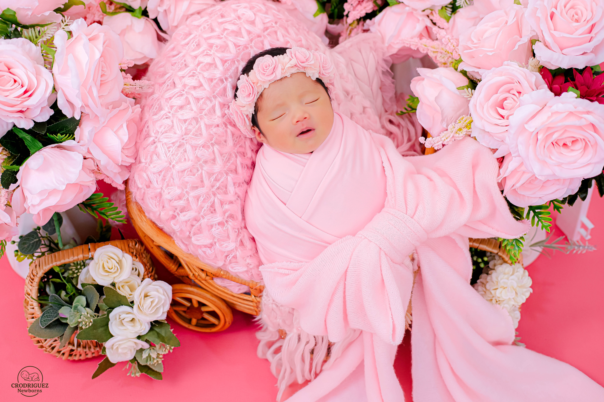
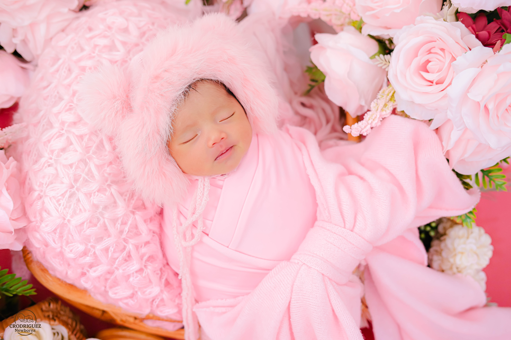
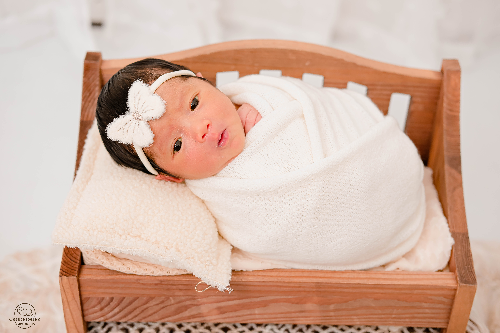

*{

margin:0;

padding:0;

box-sizing:border-box;

}

body{

background:#F9F7F4;

font-family:Montserrat,sans-serif;

overflow:hidden;

}

#loader{

height:100vh;

display:flex;

justify-content:center;

align-items:center;

text-align:center;

background:linear-gradient(to bottom,#FDFCFB,#F7F2EB);

padding:40px;

}

.loader-content{

max-width:700px;

animation:fadeIn 2s ease;

}

.small-text{

letter-spacing:4px;

text-transform:uppercase;

color:#A68A64;

margin-bottom:30px;

font-size:14px;

}

#typing{

font-family:'Pinyon Script',cursive;

font-size:72px;

color:#8A6A43;

min-height:90px;

margin-bottom:20px;

}

.subtitle{

font-size:22px;

font-family:'Cormorant Garamond',serif;

margin-bottom:20px;

}

.loader-content h2{

font-family:'Cormorant Garamond',serif;

font-size:42px;

margin-bottom:25px;

color:#6F5539;

}

.loader-content p:last-of-type{

font-size:22px;

font-family:'Cormorant Garamond',serif;

margin-bottom:40px;

}

button{

padding:18px 50px;

border:none;

background:#B9975B;

color:white;

font-size:16px;

border-radius:50px;

cursor:pointer;

transition:.4s;

}

button:hover{

background:#8A6A43;

transform:translateY(-3px);

}

@keyframes fadeIn{

from{

opacity:0;

transform:translateY(40px);

}

to{

opacity:1;

transform:translateY(0);

}

}/* ---------------------- */
/* Envelope */
/* ---------------------- */

#envelopeScreen{

position:fixed;

top:0;

left:0;

width:100%;

height:100vh;

background:#f8f5f1;

display:none;

justify-content:center;

align-items:center;

overflow:hidden;

z-index:900;

}

.envelope{

width:340px;

height:220px;

background:#efe5d8;

position:relative;

cursor:pointer;

box-shadow:0 20px 40px rgba(0,0,0,.15);

transition:1s;

}

.flap{

position:absolute;

top:0;

left:0;

width:100%;

height:120px;

background:#d9c7af;

clip-path:polygon(0 0,100% 0,50% 100%);

transform-origin:top;

transition:1s;

z-index:5;

}

.letter{

position:absolute;

background:white;

width:90%;

height:180px;

left:5%;

top:20px;

display:flex;

flex-direction:column;

justify-content:center;

align-items:center;

transition:1s;

z-index:2;

}

.letter h2{

font-family:'Cormorant Garamond',serif;

font-size:42px;

color:#8d6d44;

margin-bottom:15px;

}

.letter p{

letter-spacing:4px;

text-transform:uppercase;

font-size:12px;

color:#999;

}

.open .flap{

transform:rotateX(180deg);

}

.open .letter{

transform:translateY(-130px);

}

/* ---------------------- */
/* Hero */
/* ---------------------- */

#hero{

display:none;

height:100vh;

background-image:url(images/hero.jpg);

background-size:cover;

background-position:center;

position:relative;

animation:zoomHero 20s infinite alternate;

}

.hero-overlay{

background:rgba(255,255,255,.35);

backdrop-filter:blur(3px);

height:100%;

display:flex;

flex-direction:column;

justify-content:center;

align-items:center;

text-align:center;

}

.welcome{

font-size:20px;

letter-spacing:4px;

text-transform:uppercase;

color:#8d6d44;

margin-bottom:20px;

}

.hero-overlay h1{

font-size:90px;

font-family:'Pinyon Script',cursive;

color:#6b5335;

}

.hero-overlay h3{

font-family:'Cormorant Garamond',serif;

font-size:45px;

font-weight:400;

color:#86633d;

}

@keyframes zoomHero{

from{

background-size:100%;

}

to{

background-size:110%;

}
}

/* ---------------------- */
/* Sparkles */
/* ---------------------- */

.sparkles{

position:absolute;

width:100%;

height:100%;

background-image:
radial-gradient(circle,#d8b46c 2px,transparent 2px);

background-size:80px 80px;

animation:sparkleMove 12s linear infinite;

opacity:.4;

}

@keyframes sparkleMove{

from{

transform:translateY(0);

}

to{

transform:translateY(-80px);

}

}.hero-content{

animation:heroFade 2.5s ease;

padding:30px;

}

.hero-overlay{

background:rgba(255,255,255,.30);

backdrop-filter:blur(6px);

}

.gold-line{

width:180px;

height:1px;

background:#caa86a;

margin:25px auto;

opacity:.8;

}

.gold-line.small{

width:120px;

margin-top:30px;

margin-bottom:30px;

}

.hero-content h1{

font-size:92px;

font-family:'Pinyon Script',cursive;

font-weight:400;

color:#7d5c36;

margin-bottom:0;

}

.hero-content h2{

font-size:40px;

font-family:'Cormorant Garamond',serif;

font-weight:400;

letter-spacing:3px;

margin-bottom:30px;

color:#6b5335;

}

.date{

font-family:'Montserrat';

letter-spacing:5px;

text-transform:uppercase;

font-size:14px;

color:#8b6d45;

margin-top:10px;

}

.verse{

max-width:650px;

margin:auto;

font-size:28px;

font-family:'Cormorant Garamond',serif;

font-style:italic;

color:#6e5437;

line-height:1.8;

}

.verse-ref{

display:block;

margin-top:20px;

letter-spacing:3px;

font-size:13px;

text-transform:uppercase;

color:#9f8358;

}

.scroll-indicator{

margin-top:60px;

font-size:40px;

color:#b89455;

animation:bounce 2s infinite;

}

@keyframes bounce{

0%,100%{

transform:translateY(0);

}

50%{

transform:translateY(15px);

}

}

@keyframes heroFade{

from{

opacity:0;

transform:translateY(40px);

}

to{

opacity:1;

transform:translateY(0);

}

}.section{

padding:120px 25px;

background:white;

}

.container{

max-width:900px;

margin:auto;

text-align:center;

}

.section h2{

font-size:55px;

font-family:'Cormorant Garamond';

font-weight:400;

color:#7b5f39;

margin-bottom:20px;

}

.section p{

font-size:23px;

font-family:'Cormorant Garamond';

line-height:2;

color:#666;

}

.fade{

opacity:0;

transform:translateY(50px);

transition:1.2s;

}

.fade.show{

opacity:1;

transform:translateY(0);

}.family-section{

padding:140px 8%;

background:#fcfaf7;

}

.family-container{

display:flex;

align-items:center;

justify-content:center;

gap:80px;

max-width:1300px;

margin:auto;

flex-wrap:wrap;

}

.family-image{

flex:1;

min-width:350px;

}

.family-image img{

width:100%;

border-radius:18px;

box-shadow:0 30px 60px rgba(0,0,0,.15);

transition:.6s;

}

.family-image img:hover{

transform:scale(1.02);

}

.family-text{

flex:1;

min-width:320px;

}

.small-title{

letter-spacing:5px;

font-size:13px;

text-transform:uppercase;

color:#b79558;

margin-bottom:15px;

}

.family-text h2{

font-size:62px;

font-family:'Cormorant Garamond';

font-weight:400;

color:#7d5f39;

margin-bottom:25px;

}

.family-text p{

font-size:23px;

line-height:2;

font-family:'Cormorant Garamond';

color:#666;

margin-bottom:35px;

}

.family-text h3{

font-family:'Pinyon Script';

font-size:44px;

color:#9a7848;

font-weight:400;

}

.family-text h4{

font-size:30px;

font-family:'Cormorant Garamond';

font-weight:400;

color:#6e5437;

}/* ===========================
   Story Book
=========================== */

.name-story{

padding:150px 8%;

background:#f9f6f1;

}

.book{

display:flex;

gap:80px;

max-width:1300px;

margin:auto;

align-items:center;

flex-wrap:wrap;

}

.book.reverse{

flex-direction:row-reverse;

}

.book-left{

flex:1;

min-width:320px;

}

.book-right{

flex:1;

min-width:340px;

background:white;

padding:60px;

border-radius:12px;

box-shadow:0 30px 60px rgba(0,0,0,.08);

position:relative;

overflow:hidden;

}

.book-right::before{

content:"";

position:absolute;

left:0;

top:0;

width:8px;

height:100%;

background:#d9b77d;

}

.chapter{

letter-spacing:5px;

font-size:13px;

color:#b89559;

text-transform:uppercase;

margin-bottom:15px;

}

.book-left h2{

font-size:64px;

font-family:'Cormorant Garamond';

font-weight:400;

color:#7a5b36;

margin-bottom:20px;

}

.intro{

font-size:24px;

line-height:1.8;

font-family:'Cormorant Garamond';

color:#666;

}

.book-right p{

font-size:22px;

line-height:2.1;

font-family:'Cormorant Garamond';

color:#666;

}

.book-right strong{

color:#8b6d44;

font-weight:600;

}

.second{

padding-top:30px;

padding-bottom:170px;

}/* =======================================
   LUXURY GALLERY
======================================= */

.gallery-section{

    padding:150px 8%;
    background:#ffffff;

}

.gallery-header{

    text-align:center;
    max-width:850px;
    margin:auto;
    margin-bottom:70px;

}

.gallery-header h2{

font-family:'Cormorant Garamond',serif;

font-size:62px;

font-weight:400;

color:#7b5f39;

margin-bottom:20px;

animation:floatTitle 6s ease-in-out infinite;

}

.gallery-header p{

    font-family:'Cormorant Garamond',serif;
    font-size:22px;
    line-height:2;
    color:#666;

}

.gallery-grid{

    column-count:3;
    column-gap:22px;

}

.gallery-item{

    width:100%;
    margin-bottom:22px;

    border-radius:18px;

    cursor:pointer;

    display:block;

    break-inside:avoid;

    box-shadow:0 15px 35px rgba(0,0,0,.08);

    opacity:0;

    transform:translateY(60px) scale(.96);

    transition:
        transform .6s ease,
        box-shadow .4s ease,
        opacity .8s ease;

}

.gallery-item.show{

    opacity:1;

    transform:translateY(0) scale(1);

}

.gallery-item:hover{

    transform:translateY(-8px) scale(1.02);

    box-shadow:0 30px 60px rgba(0,0,0,.15);

}

.gallery-item:hover{

    transform:translateY(-8px) scale(1.02);

}

@media(max-width:992px){

.gallery-grid{

column-count:2;

}

}

@media(max-width:600px){

.gallery-grid{

column-count:1;

}

}/* =======================================
   LIGHTBOX
======================================= */

#lightbox{

display:none;

position:fixed;

top:0;
left:0;

width:100%;
height:100%;

background:rgba(15,15,15,.95);

justify-content:center;

align-items:center;

z-index:99999;

animation:fadeIn .4s;

}

#lightboxImage{

max-width:90%;
max-height:88%;

border-radius:18px;

box-shadow:0 30px 70px rgba(0,0,0,.5);

}

#closeLightbox{

position:absolute;

top:30px;
right:40px;

font-size:55px;

cursor:pointer;

color:white;

transition:.3s;

}

#closeLightbox:hover{

transform:rotate(90deg);

}

#prevPhoto,
#nextPhoto{

position:absolute;

top:50%;

transform:translateY(-50%);

background:rgba(255,255,255,.12);

border:none;

width:70px;
height:70px;

border-radius:50%;

font-size:38px;

color:white;

cursor:pointer;

transition:.3s;

}

#prevPhoto{

left:30px;

}

#nextPhoto{

right:30px;

}

#prevPhoto:hover,
#nextPhoto:hover{

background:#c9a86a;

}
.gallery-item::selection{

background:transparent;

}

.gallery-item{

overflow:hidden;

}

.gallery-item:hover{

filter:brightness(1.02);

}
.gallery-item{

position:relative;

}

.gallery-item::after{

content:"";

position:absolute;

left:0;

top:0;

width:100%;

height:100%;

border-radius:18px;

background:linear-gradient(
to top,
rgba(0,0,0,.15),
transparent 45%
);

opacity:0;

transition:.4s;

pointer-events:none;

}

.gallery-item:hover::after{

opacity:1;

}
@keyframes floatTitle{

0%,100%{

transform:translateY(0);

}

50%{

transform:translateY(-8px);

}

}
.gallery-header{

position:relative;

overflow:hidden;

}

.gallery-header::before{

content:"";

position:absolute;

top:-80px;

left:-80px;

width:220px;

height:220px;

background:radial-gradient(circle,
rgba(201,168,106,.18),
transparent 70%);

animation:sparkleGlow 8s ease-in-out infinite;

pointer-events:none;

}

@keyframes sparkleGlow{

0%,100%{
transform:translate(0,0) scale(1);
}

50%{
transform:translate(40px,30px) scale(1.25);
}

}
/* =======================================
INVITATION
======================================= */

.invitation-section{

padding:170px 8%;

background:#f9f7f3;

}

.invitation-card{

max-width:900px;

margin:auto;

background:white;

padding:90px;

border-radius:25px;

box-shadow:0 30px 80px rgba(0,0,0,.08);

text-align:center;

position:relative;

overflow:hidden;

}

.invitation-card::before{

content:"";

position:absolute;

top:-120px;

right:-120px;

width:260px;

height:260px;

background:radial-gradient(circle,
rgba(201,168,106,.12),
transparent 70%);

}

.cross-icon{

font-size:40px;

color:#c7a96b;

margin-bottom:30px;

}

.invite-small{

letter-spacing:4px;

text-transform:uppercase;

font-size:13px;

color:#b69458;

margin-bottom:25px;

}

.parents{

font-family:'Cormorant Garamond';

font-size:46px;

font-weight:400;

color:#7a5b36;

line-height:1.6;

}

.parents span{

display:block;

font-family:'Pinyon Script';

font-size:48px;

margin:12px 0;

color:#b89559;

}

.invite-text{

margin:40px 0;

font-family:'Cormorant Garamond';

font-size:24px;

color:#666;

line-height:1.8;

}

.invitation-card h1{

font-family:'Pinyon Script';

font-size:88px;

font-weight:400;

color:#7a5b36;

}

.invitation-card h3{

font-family:'Cormorant Garamond';

font-size:38px;

font-weight:400;

letter-spacing:4px;

margin-bottom:35px;

color:#8b6d44;

}

.invitation-card h4{

margin-top:35px;

font-size:18px;

letter-spacing:6px;

text-transform:uppercase;

color:#b89559;

}

.date-big{

font-family:'Cormorant Garamond';

font-size:62px;

font-weight:400;

margin:20px 0;

color:#6f5335;

}

.invitation-card h5{

font-size:26px;

letter-spacing:3px;

margin-bottom:40px;

font-weight:400;

color:#777;

}

.church-name{

font-family:'Cormorant Garamond';

font-size:28px;

line-height:1.8;

color:#666;

max-width:600px;

margin:auto;

}
.invitation-card::after{

content:"";

position:absolute;

left:35px;

bottom:35px;

width:80px;

height:80px;

border-left:1px solid #d7bc8d;

border-bottom:1px solid #d7bc8d;

opacity:.7;

}

.corner-top{

position:absolute;

top:35px;

right:35px;

width:80px;

height:80px;

border-top:1px solid #d7bc8d;

border-right:1px solid #d7bc8d;

}
/* =======================================
BIRTH STORY
======================================= */

.birth-section{

padding:170px 8%;

background:white;

}

.birth-header{

text-align:center;

max-width:900px;

margin:auto;

margin-bottom:80px;

}

.birth-header h2{

font-family:'Cormorant Garamond';

font-size:64px;

font-weight:400;

color:#7a5b36;

margin-bottom:25px;

}

.birth-header p{

font-size:22px;

font-family:'Cormorant Garamond';

line-height:2;

color:#666;

}

.birth-grid{

display:grid;

grid-template-columns:repeat(auto-fit,minmax(250px,1fr));

gap:30px;

max-width:1200px;

margin:auto;

}

.birth-card{

background:#fff;

padding:45px;

border-radius:20px;

text-align:center;

box-shadow:0 20px 50px rgba(0,0,0,.08);

transition:.4s;

opacity:0;

transform:translateY(40px);

}

.birth-card.show{

opacity:1;

transform:translateY(0);

}

.birth-card:hover{

transform:translateY(-10px);

box-shadow:0 35px 70px rgba(0,0,0,.12);

}

.birth-card span{

font-size:42px;

display:block;

margin-bottom:20px;

}

.birth-card h3{

font-family:'Cormorant Garamond';

font-size:30px;

font-weight:500;

color:#7b5f39;

margin-bottom:15px;

}

.birth-card p{

font-family:'Cormorant Garamond';

font-size:22px;

line-height:1.8;

color:#666;

}
/* =========================
   Timeline
========================= */

.timeline-section{

    padding:120px 10%;
    background:#faf7f2;

}

.timeline{

    position:relative;
    max-width:900px;
    margin:auto;

}

.timeline::before{

    content:'';
    position:absolute;

    left:25px;
    top:0;

    width:3px;
    height:100%;

    background:linear-gradient(
        to bottom,
        #d4af37,
        #f2e4b7
    );

}

.timeline-item{

    position:relative;
    display:flex;

    margin-bottom:80px;
    align-items:flex-start;

}

.timeline-dot{

    width:20px;
    height:20px;

    border-radius:50%;

    background:#caa25d;

    border:5px solid white;

    box-shadow:0 0 20px rgba(202,162,93,.35);

    z-index:5;

    flex-shrink:0;

}

.timeline-content{

    margin-left:40px;

    background:white;

    padding:30px;

    border-radius:20px;

    box-shadow:0 15px 40px rgba(0,0,0,.08);

    transition:.5s;

}

.timeline-content:hover{

    transform:translateY(-8px);

}

.timeline-content h3{

    color:#caa25d;
    margin-bottom:8px;
    font-size:18px;

}

.timeline-content h4{

    font-size:28px;
    color:#8b6b3f;
    margin-bottom:12px;

}

.timeline-content p{

    color:#666;
    line-height:1.8;

}
.timeline-item{

    opacity:0;
    transform:translateY(60px);

    transition:1s ease;

}

.timeline-item.show{

    opacity:1;
    transform:translateY(0);

}
/* ===========================
   Event Section
=========================== */

.event-section{

    padding:120px 10%;
    background:white;

}

.venue-grid{

    display:grid;
    grid-template-columns:repeat(2,1fr);
    gap:40px;

    margin-top:60px;

}

.venue-card{

    background:#fff;

    border-radius:25px;

    padding:50px;

    text-align:center;

    box-shadow:0 20px 60px rgba(0,0,0,.08);

    transition:.4s;

}

.venue-card:hover{

    transform:translateY(-10px);

}

.venue-icon{

    width:90px;
    height:90px;

    margin:auto;

    border-radius:50%;

    background:#f8f3ea;

    display:flex;

    justify-content:center;
    align-items:center;

    font-size:42px;

    margin-bottom:25px;

}

.venue-card h3{

    color:#caa25d;
    margin-bottom:10px;

}

.venue-card h4{

    font-size:30px;
    color:#8b6b3f;

    margin-bottom:20px;

}

.venue-card p{

    color:#666;
    line-height:1.8;

    margin-bottom:20px;

}

.venue-btn{

    display:inline-block;

    margin-top:15px;

    padding:14px 30px;

    border-radius:40px;

    background:#caa25d;

    color:white;

    text-decoration:none;

    transition:.3s;

}

.venue-btn:hover{

    background:#b88d46;

}

.schedule-card{

    margin-top:80px;

    background:#faf7f2;

    border-radius:25px;

    padding:50px;

    box-shadow:0 15px 40px rgba(0,0,0,.08);

}

.schedule-card h3{

    text-align:center;

    color:#8b6b3f;

    font-size:34px;

    margin-bottom:40px;

}

.schedule-row{

    display:flex;

    justify-content:space-between;

    align-items:center;

    padding:18px 0;

    border-bottom:1px solid rgba(0,0,0,.08);

}

.schedule-row:last-child{

    border:none;

}

.schedule-row span{

    color:#caa25d;

    font-weight:600;

    font-size:18px;

}

.schedule-row p{

    margin:0;

    color:#555;

}
@media(max-width:768px){

    .venue-grid{

        grid-template-columns:1fr;

    }

    .schedule-row{

        flex-direction:column;

        gap:10px;

        text-align:center;

    }

}
/*=========================
        RSVP
==========================*/

.rsvp-section{

    padding:120px 10%;
    background:#faf7f2;

}

.rsvp-card{

    max-width:700px;

    margin:60px auto 0;

    background:white;

    padding:60px;

    border-radius:30px;

    box-shadow:0 20px 60px rgba(0,0,0,.08);

}

.form-group{

    position:relative;

    margin-bottom:35px;

}

.form-group input,
.form-group textarea,
.form-group select{

    width:100%;

    padding:18px 20px;

    border:1px solid #ddd;

    border-radius:15px;

    outline:none;

    font-size:16px;

    background:white;

    transition:.3s;

}

.form-group textarea{

    resize:none;

}

.form-group input:focus,
.form-group textarea:focus,
.form-group select:focus{

    border-color:#caa25d;

    box-shadow:0 0 15px rgba(202,162,93,.25);

}

.form-group label{

    position:absolute;

    left:18px;

    top:18px;

    background:white;

    padding:0 8px;

    color:#999;

    pointer-events:none;

    transition:.3s;

}

.form-group input:focus + label,
.form-group input:valid + label,
.form-group textarea:focus + label,
.form-group textarea:valid + label{

    top:-10px;

    font-size:13px;

    color:#caa25d;

}

.submit-btn{

    width:100%;

    padding:18px;

    border:none;

    border-radius:50px;

    background:#caa25d;

    color:white;

    font-size:18px;

    cursor:pointer;

    transition:.3s;

}

.submit-btn:hover{

    transform:translateY(-3px);

    box-shadow:0 12px 30px rgba(202,162,93,.35);

}
.success-popup{

    position:fixed;

    inset:0;

    background:rgba(0,0,0,.55);

    display:flex;

    justify-content:center;

    align-items:center;

    visibility:hidden;

    opacity:0;

    transition:.4s;

    z-index:9999;

}

.success-popup.show{

    visibility:visible;

    opacity:1;

}

.success-content{

    background:white;

    padding:50px;

    border-radius:30px;

    text-align:center;

    max-width:450px;

    width:90%;

    animation:popup .5s;

}

.success-icon{

    font-size:70px;

    margin-bottom:20px;

}

.success-content button{

    margin-top:30px;

    border:none;

    background:#caa25d;

    color:white;

    padding:14px 35px;

    border-radius:40px;

    cursor:pointer;

}

@keyframes popup{

from{

transform:scale(.7);

opacity:0;

}

to{

transform:scale(1);

opacity:1;

}

}
/*=========================
      COUNTDOWN
=========================*/

.countdown-section{

    padding:120px 10%;
    background:#fff;

}

.countdown-grid{

    display:grid;

    grid-template-columns:repeat(4,1fr);

    gap:25px;

    margin-top:60px;

}

.count-card{

    background:#faf7f2;

    border-radius:25px;

    padding:45px;

    text-align:center;

    box-shadow:0 15px 40px rgba(0,0,0,.08);

}

.count-card h3{

    font-size:58px;

    color:#caa25d;

    margin-bottom:10px;

}

.count-card p{

    color:#777;

    letter-spacing:2px;

    text-transform:uppercase;

}
#progressBar{

    position:fixed;

    top:0;

    left:0;

    height:4px;

    width:0%;

    background:linear-gradient(90deg,#caa25d,#f5d77d);

    z-index:99999;

}
#topBtn{

position:fixed;

bottom:35px;

right:35px;

width:55px;

height:55px;

border:none;

border-radius:50%;

background:#caa25d;

color:white;

font-size:22px;

cursor:pointer;

display:none;

box-shadow:0 15px 35px rgba(0,0,0,.2);

transition:.3s;

}

#topBtn:hover{

transform:translateY(-5px);

}
.sparkles{

position:fixed;

inset:0;

pointer-events:none;

overflow:hidden;

z-index:1;

}

.sparkles::before,
.sparkles::after{

content:"✦";

position:absolute;

font-size:20px;

color:rgba(202,162,93,.35);

animation:floatSparkle 12s linear infinite;

}

.sparkles::before{

left:18%;

top:100%;

animation-delay:0s;

}

.sparkles::after{

right:22%;

top:100%;

animation-delay:6s;

}

@keyframes floatSparkle{

0%{

transform:translateY(0) rotate(0deg);

opacity:0;

}

10%{

opacity:1;

}

100%{

transform:translateY(-120vh) rotate(360deg);

opacity:0;

}

}
/*====================================
      MUSIC BUTTON
=====================================*/

#musicBtn{

position:fixed;

left:35px;

bottom:35px;

width:60px;

height:60px;

border:none;

border-radius:50%;

background:rgba(255,255,255,.9);

backdrop-filter:blur(12px);

color:#b89559;

font-size:24px;

cursor:pointer;

box-shadow:0 15px 40px rgba(0,0,0,.15);

transition:.3s;

z-index:9999;

}

#musicBtn:hover{

transform:scale(1.08);

background:#b89559;

color:white;

}
<!DOCTYPE html>
<html lang="en">

<head>

<meta charset="UTF-8">

<meta name="viewport" content="width=device-width, initial-scale=1.0">

<title>Kaleigh Franzelle Cordova Occo</title>

<link rel="stylesheet" href="style.css">

<link rel="preconnect" href="https://fonts.googleapis.com">

<link rel="preconnect" href="https://fonts.gstatic.com" crossorigin>

<link href="https://fonts.googleapis.com/css2?family=Cormorant+Garamond:wght@300;400;500;600&family=Pinyon+Script&family=Montserrat:wght@300;400;500&display=swap" rel="stylesheet">

</head>

<button id="topBtn">

↑

</button>
<<body>
<!-- ========================================= -->
<!-- MUSIC PLAYER -->
<!-- ========================================= -->

<audio id="bgMusic" loop>
    <source src="music/lullaby.mp3" type="audio/mpeg">
</audio>

<button id="musicBtn">
    ♪
</button>

    

<!-- Opening Loader -->

    

        

            A little miracle...
        

        <h1 id="typing"></h1>

        

            Join us as we welcome
        

        <h2>
            Kaleigh Franzelle Cordova Occo
        </h2>

        

            into God's loving family.
        

        <button id="enterButton">
            Open Invitation
        </button>

    

<!-- Envelope Screen -->

<h2>

You're Invited

</h2>

Tap to open

<!-- Hero Section -->

<section id="hero">

Welcome to the Baptism of

<h1>

Kaleigh Franzelle

</h1>

<h2>

Cordova Occo

</h2>

September 26, 2026

"Every good and perfect gift is from above."

James 1:17

↓

</section>
<section class="section fade">

<h2>

Our Precious Little Blessing

</h2>

On June 27, 2026,

God entrusted us with our greatest blessing.

Today, with grateful hearts,

we joyfully present our daughter,

Kaleigh Franzelle Cordova Occo,

to receive the Sacrament of Baptism

and be welcomed into God's loving family.

<section class="section fade">
<section class="family-section fade">

OUR LITTLE FAMILY

<h2>

Made With Love

</h2>

Some of life's greatest blessings arrive quietly, changing everything in the most beautiful way.

Kaleigh filled our hearts with a love we never knew existed.

As we celebrate this special milestone, we are grateful to share this joyful day with the people who have become part of our journey.

<h3>

With love,

</h3>

<h4>

Katrina, Kurt & Kaleigh

</h4>

</section>
<section class="name-story fade">

CHAPTER ONE

<h2>

The Story Behind Her Name

</h2>

Every name has a story.

Ours began long before she arrived.

Before I arrived, Mom and Dad searched for a name filled with love and grace.

Their journey began with countless conversations, endless lists, and quiet evenings imagining the little girl they were about to meet.

Wanting my name to forever connect them both, they chose the letter <strong>K</strong>—the first letter they shared—as the beginning of my story.

After days of searching, just one day before I was born, they found the name <strong>Kaleigh</strong>.

The moment they said it aloud...

they knew.

It simply felt like me.

</section>
<section class="name-story second fade">

<h2>

Franzelle

</h2>

A name made with love.

To complete my name, Mom and Dad looked to Dad's second name, <strong>Franz</strong>.

With a gentle touch, they created

<strong>Franzelle</strong>—

a beautiful bridge connecting father and daughter forever.

Together,

<strong>Kaleigh Franzelle Cordova Occo</strong>

became more than a name.

It became the first gift my parents ever gave me.

A love letter that I'll carry for the rest of my life.

</section>
<section class="timeline-section">

    

        Our Journey
        <h2>Her Story</h2>
    

    

        

            

            

                <h3>June 27, 2026</h3>
                <h4>Welcome to the World</h4>
                

                    Our precious Kaleigh Franzelle Cordova Occo was born,
                    filling our hearts with endless love and joy.
                

            

        

        

            

            

                <h3>September 26, 2026</h3>
                <h4>Holy Baptism</h4>
                

                    Surrounded by family and friends,
                    she begins her journey of faith.
                

            

        

        

            

            

                <h3>September 26, 2026</h3>
                <h4>Reception Celebration</h4>
                

                    A joyful gathering filled with laughter,
                    love and treasured memories.
                

            

        

        

            

            

                <h3>Forever</h3>
                <h4>God's Loving Guidance</h4>
                

                    May His light guide every step of her life.
                

            

        

    

</section>
<section class="event-section">

    

        Celebrate With Us
        <h2>Event Details</h2>
    

    

        <!-- Church -->

        

            
⛪

            <h3>Baptism Ceremony</h3>

            <h4>Sacred Heart Parish</h4>

            

                September 26, 2026
                 
                10:30 AM
            

            

                242 Dionisio Jakosalem St, 
                Cebu City, 6000 Cebu
            

            <a href="https://www.google.com/maps/place/The+Archdiocesan+Shrine+of+the+Most+Sacred+Heart+of+Jesus/@10.3089026,123.8964778,17z/data=!3m1!4b1!4m6!3m5!1s0x33a99945a8c6b021:0x8b5d0f001d6ce9a1!8m2!3d10.3088973!4d123.8990527!16s%2Fg%2F1tftbvzd?entry=ttu&g_ep=EgoyMDI2MDgwNC4wIKXMDSoASAFQAw%3D%3D"
   target="_blank"
   class="venue-btn">
    View Map
</a>

        

        <!-- Reception -->

        

            
🎉

            <h3>Reception</h3>

            <h4>Hannah's Party Place</h4>

            

                September 26, 2026
                 
                12:00 PM
            

            

                334 Dionisio Jakosalem St, 
        Cebu City, 6000 Cebu
            

            <a href="https://www.google.com/maps/place/Hannah's+Cake+Decors+%26+Party+Needs/@10.3090341,123.8972085,17z/data=!3m1!4b1!4m6!3m5!1s0x33a99900773e7245:0x6eb30d63da40e425!8m2!3d10.3090288!4d123.8997888!16s%2Fg%2F11x07x04p9?entry=ttu&g_ep=EgoyMDI2MDgwNC4wIKXMDSoASAFQAw%3D%3D"
   target="_blank"
   class="venue-btn">
    View Map
</a>

        

    

    

        <h3>Celebration Schedule</h3>

        

            10:00 AM
            
Guest Arrival

        

        

            10:30 AM
            
Baptism Ceremony

        

        

            12:00 PM
            
Reception

        

        

            3:00 PM
            
Closing Prayer

        

    

</section>
<section class="rsvp-section" id="rsvp">

    

        We'd Love To Celebrate With You
        <h2>RSVP</h2>
    

    

        <form id="rsvpForm">

            

    <input
        type="text"
        id="name"
        name="name"
        autocomplete="name"
        required>
    <label>Full Name</label>

            

    <input
        type="number"
        id="guests"
        name="guests"
        min="1"
        max="10"
        required>
    <label>Number of Guests</label>

            

    <select
        id="attendance"
        name="attendance"
        required>

        <option value="" disabled selected>
            Please select
        </option>

        <option value="Joyfully Accepts">
            Joyfully Accepts
        </option>

        <option value="Regretfully Declines">
            Regretfully Declines
        </option>

    </select>

            

    <textarea
        id="message"
        name="message"
        rows="5"
        maxlength="250"></textarea>

    <label>Your Blessing for Kaleigh</label>

            <button
    id="submitBtn"
    type="submit"
    class="submit-btn">
    Send RSVP
</button>

        </form>

    

</section>

    

        

            ❤️
        

        <h2>Thank You!</h2>

        

            Your RSVP has been received.

            We can't wait to celebrate Kaleigh's Baptism with you.
        

        <button onclick="closePopup()">
            Close
        </button>

    

<!-- ========================================= -->
<!-- COUNTDOWN -->
<!-- ========================================= -->

<section class="countdown-section">

    

        Only a Little While

        <h2>Until My Baptism</h2>

    

    

        

            <h3 id="days">00</h3>
            
Days

        

        

            <h3 id="hours">00</h3>
            
Hours

        

        

            <h3 id="minutes">00</h3>
            
Minutes

        

        

            <h3 id="seconds">00</h3>
            
Seconds

        

    

</section>
<!-- ========================================= -->
<!-- GALLERY -->
<!-- ========================================= -->

<section class="gallery-section fade">

    

        

            OUR LITTLE MIRACLE
        

        <h2>
            A Few Moments We'll Treasure Forever
        </h2>

        

        

            Every tiny yawn,
            every peaceful dream,
            every little smile...
            these are the memories we'll cherish forever.
        

    

    

        
        
        
        
        
        
        
        
        

    

</section>

<!-- ========================================= -->
<!-- LIGHTBOX -->
<!-- ========================================= -->

    &times;

    <button id="prevPhoto">❮</button>

    

    <button id="nextPhoto">❯</button>

<!-- ========================================= -->
<!-- INVITATION -->
<!-- ========================================= -->

<section class="invitation-section fade">

    

        

        
✝

        

            Together with our families,
        

        <h2 class="parents">

            Katrina Cordova

            &

            Kurt Franz Occo

        </h2>

        

            joyfully invite you to witness the Baptism of

        

        <h1>

            Kaleigh Franzelle

        </h1>

        <h3>

            Cordova Occo

        </h3>

        

        <h4>

            Saturday

        </h4>

        <h2 class="date-big">

            September 26, 2026

        </h2>

        <h5>

            10:00 AM

        </h5>

        

        

            The Archdiocesan Shrine of the

            Most Sacred Heart of Jesus

        

    

</section>
<!-- ========================================= -->
<!-- BIRTH STORY -->
<!-- ========================================= -->

<section class="birth-section fade">

    

        

            A BEAUTIFUL BEGINNING

        

        <h2>

            The Day She Arrived

        </h2>

        

        

            On a beautiful morning in Cebu City,

            our hearts were forever changed.

            This was the day our greatest blessing

            finally arrived.

        

    

    

        

            

<i data-lucide="baby"></i>

            <h3>Full Name</h3>
            
Kaleigh Franzelle Cordova Occo

        

        

            

<i data-lucide="calendar-days"></i>

            <h3>Date</h3>
            
June 27, 2026

        

        

            

<i data-lucide="clock-3"></i>

            <h3>Time</h3>
            
9:50 AM

        

        

            

<i data-lucide="hospital"></i>

            <h3>Hospital</h3>
            
Saint Anthony Mother & Child Hospital

        

        

            

<i data-lucide="map-pin"></i>

            <h3>Location</h3>
            
Cebu City

        

        

            

<i data-lucide="scale"></i>

            <h3>Weight</h3>
            
2.6 kg

        

        

            

<i data-lucide="ruler"></i>

            <h3>Length</h3>
            
50 cm

        

    

</section>
<audio id="music" loop>

<source src="music/piano.mp3" type="audio/mpeg">

</audio>

</body>>

A little miracle...

<h1 id="typing">

</h1>

Join us as we welcome

<h2>

Kaleigh Franzelle Cordova Occo

</h2>

into God's loving family.

<button id="enterButton">

Open Invitation

</button>

<audio id="music" loop>

<source src="music/piano.mp3" type="audio/mpeg">

</audio>

</body>

</html>
const form = document.getElementById("rsvpForm");
const popup = document.getElementById("successPopup");

const scriptURL = "https://script.google.com/macros/s/AKfycby2D5JyMLlHVS2xVtrC3oF4hCMwM0jmIqfbLQvJ9vTpEqat2uWD4A9nrwIRmIOkq4jz/exec";

form.addEventListener("submit", async function (e) {

    e.preventDefault();

    const submitBtn = form.querySelector("button[type='submit']");
    const originalText = submitBtn.innerHTML;

    submitBtn.disabled = true;
    submitBtn.innerHTML = "Sending...";

    const data = {
        name: document.getElementById("name").value.trim(),
        guests: document.getElementById("guests").value,
        attendance: document.getElementById("attendance").value,
        message: document.getElementById("message").value.trim(),
        userAgent: navigator.userAgent
    };

    try {

        const response = await fetch(scriptURL, {
            method: "POST",
            headers: {
                "Content-Type": "text/plain;charset=utf-8"
            },
            body: JSON.stringify(data)
        });

        const result = await response.json();

        if (result.result === "success") {

            popup.classList.add("show");

            form.reset();

        } else {

            alert("Unable to save RSVP. Please try again.");

        }

    } catch (error) {

        console.error(error);

        alert("Something went wrong. Please try again.");

    } finally {

        submitBtn.disabled = false;
        submitBtn.innerHTML = originalText;

    }

});

function closePopup() {
    popup.classList.remove("show");
}
const text="A Beautiful Blessing";

let i=0;

function typeWriter(){

if(i<text.length){

document.getElementById("typing").innerHTML+=text.charAt(i);

i++;

setTimeout(typeWriter,90);

}

}

window.onload=function(){

typeWriter();

}

const loader=document.getElementById("loader");

const envelope=document.getElementById("envelopeScreen");

const hero=document.getElementById("hero");

const music=document.getElementById("music");

document.getElementById("enterButton").onclick=function(){

music.volume=.25;

music.play();

loader.style.opacity="0";

setTimeout(()=>{

loader.style.display="none";

envelope.style.display="flex";

},800);

}

document.querySelector(".envelope").onclick=function(){

this.classList.add("open");

setTimeout(()=>{

envelope.style.opacity="0";

},1500);

setTimeout(()=>{

envelope.style.display="none";

hero.style.display="block";

document.body.style.overflow="auto";

window.scrollTo(0,0);

},2200);

}
const observer=new IntersectionObserver(entries=>{

entries.forEach(entry=>{

if(entry.isIntersecting){

entry.target.classList.add("show");

}

});

});

document.querySelectorAll(".fade").forEach(section=>{

observer.observe(section);

});
const books=document.querySelectorAll(".book");

const bookObserver=new IntersectionObserver((entries)=>{

entries.forEach(entry=>{

if(entry.isIntersecting){

entry.target.animate(

[

{

opacity:0,

transform:"translateY(80px) scale(.97)"

},

{

opacity:1,

transform:"translateY(0) scale(1)"

}

],

{

duration:1400,

fill:"forwards",

easing:"ease"

}

);

}

});

});

books.forEach(book=>{

book.style.opacity=0;

bookObserver.observe(book);

});
/* =======================================
   GALLERY
======================================= */

const galleryItems=document.querySelectorAll(".gallery-item");

const lightbox=document.getElementById("lightbox");

const lightboxImage=document.getElementById("lightboxImage");

const closeLightbox=document.getElementById("closeLightbox");

const prev=document.getElementById("prevPhoto");

const next=document.getElementById("nextPhoto");

let currentPhoto=0;

/* ---------- Fade Animation ---------- */

const galleryObserver=new IntersectionObserver((entries)=>{

entries.forEach(entry=>{

if(entry.isIntersecting){

galleryItems.forEach((photo,index)=>{

setTimeout(()=>{

photo.classList.add("show");

},index*150);

});

}

});

},{threshold:.2});

galleryObserver.observe(document.querySelector(".gallery-grid"));

/* ---------- Lightbox ---------- */

galleryItems.forEach((photo,index)=>{

photo.addEventListener("click",()=>{

currentPhoto=index;

showPhoto();

lightbox.style.display="flex";

document.body.style.overflow="hidden";

});

});

function showPhoto(){

lightboxImage.src=galleryItems[currentPhoto].src;

}

next.onclick=()=>{

currentPhoto++;

if(currentPhoto>=galleryItems.length){

currentPhoto=0;

}

showPhoto();

}

prev.onclick=()=>{

currentPhoto--;

if(currentPhoto<0){

currentPhoto=galleryItems.length-1;

}

showPhoto();

}

closeLightbox.onclick=()=>{

lightbox.style.display="none";

document.body.style.overflow="auto";

}

lightbox.onclick=(e)=>{

if(e.target===lightbox){

lightbox.style.display="none";

document.body.style.overflow="auto";

}

}
/* =======================================
BIRTH CARDS
======================================= */

const birthCards=document.querySelectorAll(".birth-card");

const birthObserver=new IntersectionObserver((entries)=>{

entries.forEach(entry=>{

if(entry.isIntersecting){

birthCards.forEach((card,index)=>{

setTimeout(()=>{

card.classList.add("show");

},index*180);

});

}

});

},{threshold:.25});

birthObserver.observe(document.querySelector(".birth-grid"));
/* =======================================
COUNTDOWN
======================================= */

const targetDate=new Date("September 26, 2026 10:00:00").getTime();

setInterval(()=>{

const now=new Date().getTime();

const distance=targetDate-now;

document.getElementById("days").innerHTML=Math.floor(distance/(1000*60*60*24));

document.getElementById("hours").innerHTML=Math.floor((distance%(1000*60*60*24))/(1000*60*60));

document.getElementById("minutes").innerHTML=Math.floor((distance%(1000*60*60))/(1000*60));

document.getElementById("seconds").innerHTML=Math.floor((distance%(1000*60))/1000);

},1000);
const timelineItems = document.querySelectorAll(".timeline-item");

const timelineObserver = new IntersectionObserver(entries => {

    entries.forEach(entry => {

        if(entry.isIntersecting){

            entry.target.classList.add("show");

        }

    });

},{

    threshold:.25

});

timelineItems.forEach(item=>{

    timelineObserver.observe(item);

});
const form = document.getElementById("rsvpForm");
const popup = document.getElementById("successPopup");

form.addEventListener("submit", function(e){

    e.preventDefault();

    popup.classList.add("show");

    form.reset();

});

function closePopup(){

    popup.classList.remove("show");

}
const baptismDate = new Date("September 26, 2026 10:00:00").getTime();

setInterval(() => {

    const now = new Date().getTime();

    const distance = baptismDate - now;

    const days = Math.floor(distance / (1000 * 60 * 60 * 24));

    const hours = Math.floor((distance % (1000 * 60 * 60 * 24)) / (1000 * 60 * 60));

    const minutes = Math.floor((distance % (1000 * 60 * 60)) / (1000 * 60));

    const seconds = Math.floor((distance % (1000 * 60)) / 1000);

    document.getElementById("days").innerHTML = days;

    document.getElementById("hours").innerHTML = hours;

    document.getElementById("minutes").innerHTML = minutes;

    document.getElementById("seconds").innerHTML = seconds;

},1000);
window.addEventListener("scroll",()=>{

    const winScroll=document.documentElement.scrollTop;

    const height=document.documentElement.scrollHeight-document.documentElement.clientHeight;

    document.getElementById("progressBar").style.width=(winScroll/height)*100+"%";

});
const topBtn=document.getElementById("topBtn");

window.addEventListener("scroll",()=>{

if(window.scrollY>500){

topBtn.style.display="block";

}else{

topBtn.style.display="none";

}

});

topBtn.onclick=()=>{

window.scrollTo({

top:0,

behavior:"smooth"

});

};
const music = document.getElementById("bgMusic");
const musicBtn = document.getElementById("musicBtn");

let playing = false;

musicBtn.addEventListener("click", () => {

    if (playing) {

        music.pause();

        musicBtn.innerHTML = "♪";

    } else {

        music.play();

        musicBtn.innerHTML = "❚❚";

    }

    playing = !playing;

});
